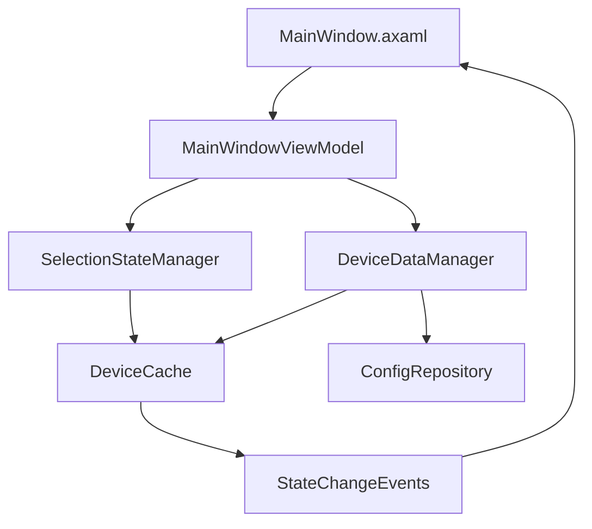

# 设备选择状态管理系统文档

## 概述

设备选择状态管理系统是AutoSerialPort应用程序的核心组件，负责处理设备列表的选择状态、数据加载、缓存管理和错误恢复。该系统解决了原有实现中的竞态条件、状态不一致和性能问题。

## 架构设计

### 核心组件



#### 1. SelectionStateManager (选择状态管理器)
- **职责**: 管理设备选择状态，提供线程安全的选择操作
- **特性**: 
  - 防抖机制防止快速点击
  - 取消令牌支持异步操作取消
  - 自动状态验证和恢复
  - 详细的操作日志记录

#### 2. DeviceDataManager (设备数据管理器)
- **职责**: 处理设备数据的加载、缓存、预加载和刷新
- **特性**:
  - 应用启动时预加载数据
  - 智能缓存刷新策略
  - 选择状态保持功能
  - 后台数据同步

#### 3. DeviceCache (设备缓存)
- **职责**: 提供线程安全的设备数据缓存
- **特性**:
  - 高效的ID和显示名称查找
  - 缓存一致性验证
  - 变更跟踪和版本管理
  - 内存优化

## 主要功能

### 1. 稳定的设备选择 (需求1.1-1.5)

#### 1.1 即时UI更新
```csharp
// 用户点击设备时，UI立即更新
await selectionManager.SelectDeviceAsync(deviceId);
// 触发SelectionChanged事件，UI在主线程更新
```

#### 1.2 选择幂等性
```csharp
// 多次选择同一设备不会产生副作用
await selectionManager.SelectDeviceAsync(deviceId); // 第一次
await selectionManager.SelectDeviceAsync(deviceId); // 第二次，快速返回
```

#### 1.3 竞态条件防护
```csharp
// 使用信号量和取消令牌防止竞态条件
private readonly SemaphoreSlim _selectionSemaphore = new(1, 1);
private CancellationTokenSource? _currentOperationCts;
```

#### 1.4 选择状态保持
```csharp
// 数据刷新时保持选择状态
await dataManager.RefreshDataAsync(preserveSelection: true);
```

#### 1.5 回退选择策略
```csharp
// 当选中设备不存在时，自动选择第一个可用设备或清除选择
if (deviceById == null && deviceByName == null) {
    // 选择第一个可用设备或清除选择
}
```

### 2. 数据一致性管理 (需求2.1-2.5)

#### 2.1 加载期间的用户交互控制
```csharp
public bool IsBusy => IsLoading || _deviceDataManager.IsLoading;
// UI根据IsBusy状态禁用相关操作
```

#### 2.2 双重匹配策略
```csharp
// 首先按ID匹配，然后按显示名称匹配
var deviceById = _deviceCache.GetById(previousSelection.DeviceId);
var deviceByName = _deviceCache.GetByDisplayName(previousSelection.DisplayName);
```

#### 2.3 状态传输完整性
```csharp
// ViewModel重建时完整传输状态
var viewModel = _deviceViewModelFactory();
viewModel.Load(profile); // 加载完整配置
```

### 3. 错误处理和恢复 (需求3.1-3.5)

#### 3.1 空状态处理
```csharp
if (_deviceCache.IsEmpty) {
    ShowEmptyState = true;
    EmptyStateTitle = "暂无设备";
    EmptyStateDescription = "当前没有配置任何串口设备，点击下方按钮添加第一个设备";
}
```

#### 3.2 数据库错误恢复
```csharp
try {
    var profiles = await _configRepository.GetSerialDeviceProfilesAsync(profileId);
} catch (Exception ex) {
    // 维持当前状态，显示错误信息
    await HandleDataOperationErrorAsync(ex, context, "加载配置失败");
}
```

#### 3.3 异常处理策略
```csharp
public class DeviceSelectionException : Exception {
    public SelectionErrorType ErrorType { get; init; }
    public long? DeviceId { get; init; }
    public string? DisplayName { get; init; }
}
```

#### 3.4 防抖和队列机制
```csharp
private const int DebounceDelayMs = 100;
await Task.Delay(DebounceDelayMs, cancellationToken); // 防抖延迟
```

#### 3.5 自动状态修正
```csharp
public bool IsSelectionValid() {
    // 验证选中设备是否仍在缓存中
    var cachedDevice = _deviceCache.GetById(currentDevice.DeviceId);
    if (cachedDevice == null) {
        // 触发自动修正
        _ = Task.Run(async () => await AttemptStateRecoveryAsync(context));
    }
}
```

### 4. 性能优化 (需求4.1-4.4)

#### 4.1 响应时间优化
- 设备选择: < 100ms
- 缓存查找: < 10ms
- UI更新: 立即响应

#### 4.2 加载指示器
```csharp
if (operationDuration > TimeSpan.FromMilliseconds(200)) {
    SetLoadingState(true, "正在加载设备数据...");
}
```

#### 4.3 高效数据结构
```csharp
private readonly ConcurrentDictionary<long, IDeviceProfileViewModel> _devicesById;
private readonly ConcurrentDictionary<string, IDeviceProfileViewModel> _devicesByDisplayName;
```

#### 4.4 批量更新优化
```csharp
// 批量更新UI以减少重绘
Dispatcher.UIThread.Post(() => {
    // 批量更新UI属性
});
```

### 5. 应用启动预加载 (需求5.1-5.5)

#### 5.1 启动时预加载
```csharp
// Program.cs中的预加载
await deviceDataManager.PreloadDataAsync();
```

#### 5.2 即时数据显示
```csharp
// MainWindow打开时使用预加载数据
await vm.InitializeWithPreloadedDataAsync();
```

#### 5.3 预加载失败回退
```csharp
try {
    await vm.InitializeWithPreloadedDataAsync();
} catch {
    // 回退到传统初始化
    await vm.InitializeAsync();
}
```

#### 5.4 后台同步
```csharp
// 定期检查数据变化并同步
if (deviceDataManager.ShouldBackgroundRefresh) {
    await deviceDataManager.SmartRefreshAsync(forceRefresh: true);
}
```

#### 5.5 缓存利用优化
```csharp
public bool IsCacheValid => !_deviceCache.IsEmpty && 
    (DateTime.UtcNow - _lastCacheUpdate) < _cacheValidityPeriod;
```

## 日志记录和调试

### 日志级别配置

系统支持多级别日志记录：

- **Debug**: 详细的操作跟踪（仅在调试模式下）
- **Information**: 重要操作和状态变更
- **Warning**: 潜在问题和恢复操作
- **Error**: 错误和异常情况

### 调试模式启用

可通过以下方式启用调试模式：

1. **环境变量**: `AUTOSERIAL_DEBUG=true`
2. **命令行参数**: `--debug` 或 `-d`
3. **Debug构建**: 自动启用

### 专用日志文件

调试模式下会创建专用的设备选择日志文件：
- `logs/debug/device-selection-YYYY-MM-DD.log`
- 包含SelectionStateManager、DeviceDataManager和DeviceCache的详细日志

### 关键日志事件

#### 选择操作日志
```
2024-01-15 10:30:15.123 [DBG] SelectionStateManager: 开始选择设备，设备ID: 1
2024-01-15 10:30:15.125 [DBG] SelectionStateManager: 设备选择成功，设备ID: 1, 显示名称: 设备1
```

#### 数据加载日志
```
2024-01-15 10:30:10.100 [INF] DeviceDataManager: 开始预加载设备数据
2024-01-15 10:30:10.150 [DBG] DeviceDataManager: 从数据库加载了 3 个设备配置
2024-01-15 10:30:10.200 [INF] DeviceDataManager: 设备数据预加载完成，共加载 3 个设备
```

#### 错误恢复日志
```
2024-01-15 10:30:20.300 [WRN] SelectionStateManager: 检测到无效的设备选择状态，设备ID: 999
2024-01-15 10:30:20.305 [INF] SelectionStateManager: 开始尝试状态恢复，操作类型: SelectByDeviceId
2024-01-15 10:30:20.310 [INF] SelectionStateManager: 状态恢复完成，尝试次数: 1
```

## 故障排除指南

### 常见问题

#### 1. 设备选择无响应
**症状**: 点击设备列表无反应
**排查步骤**:
1. 检查`IsBusy`状态是否为true
2. 查看日志中是否有并发操作警告
3. 验证设备是否在缓存中存在

#### 2. 数据加载失败
**症状**: 设备列表为空或显示错误
**排查步骤**:
1. 检查数据库连接状态
2. 查看配置仓库错误日志
3. 验证默认配置文件是否存在

#### 3. 选择状态不一致
**症状**: UI显示的选中设备与实际不符
**排查步骤**:
1. 启用调试日志查看选择操作详情
2. 检查缓存一致性验证结果
3. 查看状态恢复日志

#### 4. 性能问题
**症状**: 设备选择或数据加载缓慢
**排查步骤**:
1. 检查设备数量是否过多
2. 查看缓存命中率统计
3. 分析操作耗时日志

### 调试命令

#### 启用详细日志
```bash
# Windows
set AUTOSERIAL_DEBUG=true
AutoSerialPort.Host.exe

# 或使用命令行参数
AutoSerialPort.Host.exe --debug
```

#### 查看缓存统计
```csharp
var stats = deviceCache.GetStatistics();
logger.LogInformation("缓存统计: {Stats}", stats);
```

#### 验证缓存一致性
```csharp
var validation = deviceCache.ValidateConsistency();
if (!validation.IsValid) {
    logger.LogWarning("缓存一致性问题: {Validation}", validation);
}
```

## 性能指标

### 基准性能

- **设备选择响应时间**: < 100ms (正常条件下)
- **数据预加载时间**: < 5秒 (1000个设备)
- **缓存查找时间**: < 10ms
- **UI更新延迟**: < 50ms

### 内存使用

- **基础内存占用**: ~10MB
- **每个设备**: ~1KB
- **缓存开销**: ~20%

### 并发性能

- **支持并发操作**: 是
- **线程安全**: 完全支持
- **最大并发数**: 无限制（受系统资源限制）

## 扩展和维护

### 添加新功能

1. **新的选择策略**: 实现`ISelectionStrategy`接口
2. **自定义缓存策略**: 扩展`DeviceCache`类
3. **额外的错误恢复**: 添加新的错误处理器

### 性能优化建议

1. **大量设备场景**: 考虑虚拟化或分页
2. **网络存储**: 实现异步缓存预热
3. **内存限制**: 添加LRU缓存策略

### 监控和指标

建议监控以下指标：
- 设备选择成功率
- 平均响应时间
- 缓存命中率
- 错误恢复频率
- 内存使用趋势

## 版本历史

### v1.0.0 (当前版本)
- 初始实现设备选择状态管理系统
- 支持预加载和缓存优化
- 完整的错误处理和恢复机制
- 综合的日志记录和调试支持

---

*本文档描述了AutoSerialPort应用程序中设备选择状态管理系统的完整实现。如有问题或建议，请参考源代码或联系开发团队。*